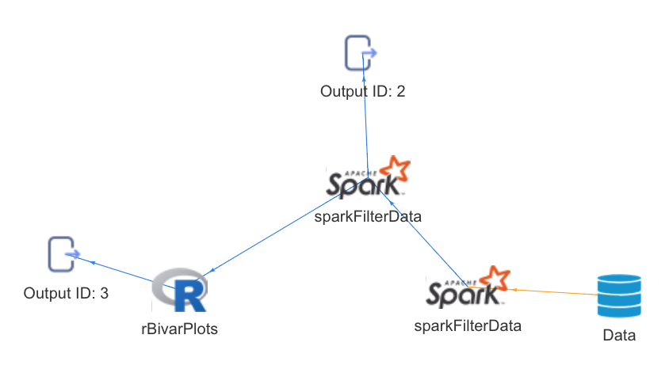
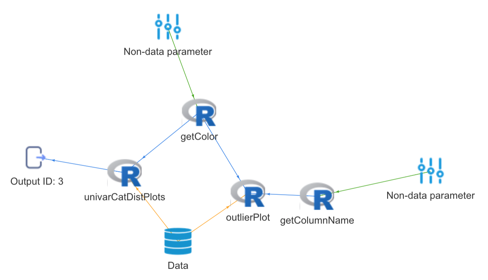
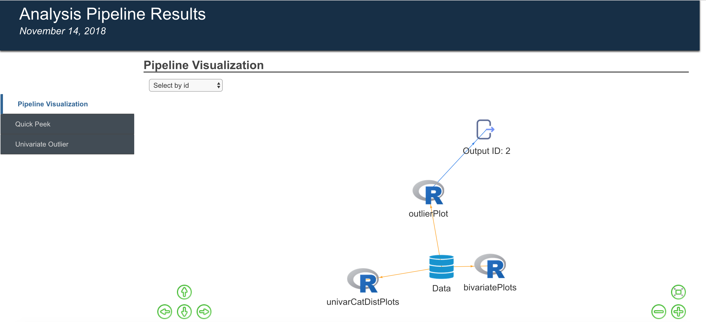
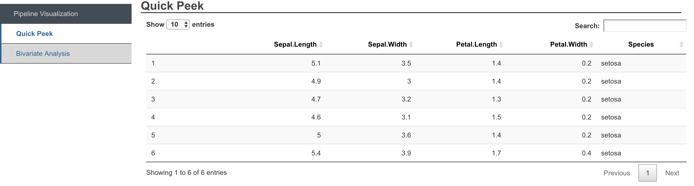
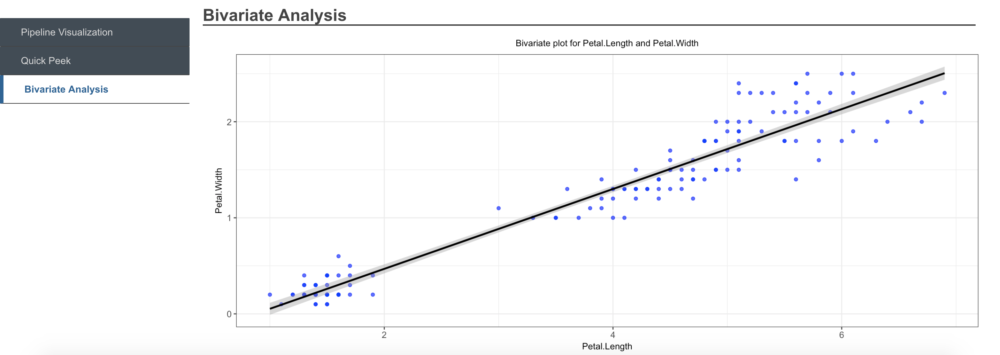
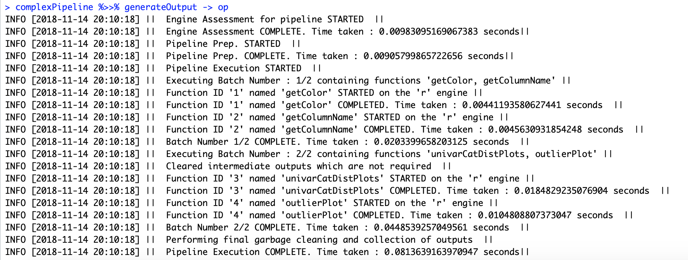

# Table of contents
1. [An overview of the package](#overview)
2. [Usage](#Usage)
3. [Features](#Features)

# An overview of the package <a name="overview"></a>

In a typical data science workflow there are multiple steps involved from data aggregation, cleaning, exploratory analysis, modeling and so on. As the data science community matures, we are seeing that there are a variety of languages which provide better capabilities for specific steps in the data science workflow. *R* is typically used for data transformations, statistical models, and visualizations, while *Python* provides more robust functions for machine learning. In addition to this, *Spark* provides an environment to process high volume data - both as one-time/ batch or as streams.

The job of today's data scientist is changing from one where they are married to a specific tool or language, to one where they are using all these tools for their specialized purposes. The key problem then becomes one of translation between these tools for seamless analysis. Additionally, in the work of a data scientist, there is a need to perform the same task repeatedly, as well as put certain analysis flows (or) pipelines into production to work on new data periodically, or work on streaming data.

Recently, interfaces for using these various tools have been published. In terms of R packages, the *reticulate* package provides an interface to Python, and the *SparkR* and *sparklyr* packages provide an interface to Spark. 

The *analysisPipelines* package uses these interfaces to enable *Interoperable Pipelines* i.e. the ability compose and execute a reusable data science pipeline which can contain functions to be executed in an *R* environment, in a *Python* environment or in a *Spark* environment. These pipelines can saved and loaded, to enable batch operation as datasets get updated with new data.

The goal of the *analysisPipelines* package is to make the job of the data scientist easier and help them compose pipelines of analysis which consist of data manipulation, exploratory analysis & reporting, as well as modeling steps. The idea is for data scientists to use tools of their choice through an *R* interface, using this package
Essentially, it allows data scientists to:

* Compose **reusable, interoperable** pipelines in a flexible manner
* Leverage available utility functions for performing different analytical operations
* Put these pipelines into production in order to execute repeatedly
* Generated analysis reports by executing these pipelines

## Types of pipelines

This package supports for both *batch/ repeated* pipelines, as well as *streaming pipelines.*

For *batch* pipelines, the vision is to enable interoperable pipelines which execute efficiently with functions in *R*, *Spark* and *Python*

For *streaming* pipelines, the package allows for streaming analyses through *Apache Spark Structured Streaming.*

## Classes and implementation

The *analysisPipelines* package uses S4 classes and methods to implement all the core functionality. The fundamental class exposed in this package is the *BaseAnalysisPipeline* class on which most of the core functions are implemented. The user, however, interacts with the *AnalysisPipeline* and *StreamingAnalysisPipeline* classes for batch and streaming analysis respectively.

## Pipelining semantics

The package stays true to the *tidyverse* pipelining style which also fits nicely into the idea of creating pipelines. The core mechanism in the package is to instantiate a pipeline with data and then pipeline required functions to the object itself.

The package allows both the use of *magrittr* pipe **(%>%)** or the *pipeR* pipe **(%>>%)**.

## Supported engines

As of this version, the package supports functions executed on *R*, or *Spark* through the SparkR interface, as well as Python functions run through *reticulate* for batch pipelines. It also supports *Apache Spark Structured Streaming* pipelines for streaming analyses.

## Available vignettes

This package contains 6 vignettes:

* **Analysis pipelines - Core functionality and working with R data frames and functions** - This is the main vignette describing the package's core functionality, and explaining this through **batch** pipelines in just **R**
* **Analysis pipelines for working with Spark DataFrames for one-time/ batch analyses** - This vignette describes creating **batch** pipelines to execute solely in a *Spark* environment 
* **Analysis pipelines for working with Python functions** - This vignette describes creating **batch** pipelines to execute solely in a *Python* environment 
* **Interoperable analysis pipelines** - This vignette describes creating and executing **batch** pipelines which are composed of functions executing across *supported engines*
* **Streaming Analysis Pipelines for working with Apache Spark Structured Streaming** - This vignette describes setting up streaming pipelines on *Apache Spark Structured Streaming*
* **Using pipelines inside Shiny widgets or apps** - A brief vignette which illustrates an example of using a pipeline inside a shiny widget with reactive elements and changing data
* **An introduction to meta-pipelines** - This vignette illustrates the use of meta-pipelines


# Usage

## Loading the package

```r
library(analysisPipelines)
```

## Creating an analysisPipeline object

An object of class *AnalysisPipeline* can be created like so:

```{r creating object, warning=F}
obj <- AnalysisPipeline(filePath = system.file("hotel_new.csv", package = "analysisPipelines")) 
class(obj)
```

While initializing the object, an input dataframe can be provided on which the pipeline should work, either by providing the filePath to a *.csv* file through the *filePath* argument, or by providing R dataframe available in the session, through the *input* argument

The *AnalysisPipeline* object has a set of getters, for retrieving various slots containing data and metadata required for pipeline execution. The most basic of them is the *getInput* method which retrieves the input dataframe with which the object has been initialized. If not initialized with a dataframe, the *setInput* method can be used to do so.

```{r printing object contents, warning=F}
obj %>>% getInput %>>% str
getRegistry()
```

The *getRegistry* function retrieves the set of functions and their metadata available for pipelining. Any *AnalysisPipeline* object comes with a set of pre-registered functions which can be used **out-of-the-box**. Of course, the user can register her own functions, to be used in the pipeline. We will explore this later on.

There are two types of functions which can be pipelined:

* **Data functions** - These functions necessarily take their **first** argument as a dataframe. These are functions focused on performing operations on data. Specifically, the nomenclature *data functions* is used for those functions which work on the input dataframe set to the pipeline object, and perform some transformation or analysis on them. They help form the main *path* in a pipeline, constituting a linear flow from the input.
* **Non-data functions** - These are auxiliary helper functions which are required in a pipeline, which may or may not operate on data. However, the *key* difference is that these functions do not operate on the **input (or some direct transformation of it)**. In essence, they help form auxiliary paths in the pipeline, which eventually merge into the main path.

Both pre-registered and user-defined functions work with the *AnalysisPipeline* object in the same way i.e. regardless of who writes the function, they follow the same semantics.

## Creating a simple pipeline

We'll now take a look at creating a simple pipeline, with some of the pre-registered functions available in the registry. We pipeline the *univarCatDistPlots* function (available as a pre-registered utility function,which generates a chart showing distribution of a categorical variable in a dataset), by simply using the *pipe* or *double pipe* operator, and providing the required additional parameters apart from the *data* on which it needs to operate, as we have already initialized the *AnalysisPipeline* object with the data.

Note that unless assigned to the same or another object, the pipeline does not get stored.

We can access the details of the pipeline as a tibble through the `getPipeline` method.

```{r pipe demo 1, warning=F}
# Running univariate categorical distribution plot on the constructed object
# ?analysisPipelines::univarCatDistPlots
obj1 <- obj %>>% univarCatDistPlots(uniCol = "building_type", priColor = "blue", optionalPlots = 0, storeOutput = T)
obj1 %>>% getPipeline
```

# Features

## User-defined functions

### Registering your own function

You can register your own *data* or *non-data* functions by calling `registerFunction.` This adds the user-defined function to the registry. The registry is maintained by the package and once registered, functions can be used across pipeline objects. The registry can be view by calling the `getRegistry` function.

```r
# Currently registered functions
getRegistry()
```


In order to register a function, first the function must be defined in the Global environment, before calling `registerFunction`.

```r
bivariatePlots <- function(dataset, select_var_name_1, select_var_name_2, 
                       priColor = "blue", secColor='black') {
  x=dataset[, select_var_name_1]
  y=dataset[, select_var_name_2]
  bivarPlot <- ggplot2::ggplot(dataset, ggplot2::aes(x,y)) +
    ggplot2::geom_point(color=priColor,alpha=0.7) +
    ggplot2::geom_smooth(method = lm,color=secColor) +
    ggplot2::xlab(select_var_name_1) +
    ggplot2::ylab(select_var_name_2) + 
    ggplot2::theme_bw() +
    ggplot2::ggtitle(paste('Bivariate plot for', select_var_name_1, 
                           'and', select_var_name_2, sep=' ')) +
    ggplot2::theme(plot.title = ggplot2::element_text(hjust = 0.5, size = 10), 
                   axis.text = ggplot2::element_text(size=10),
                   axis.title=ggplot2::element_text(size=10))
  return(bivarPlot)
}

registerFunction(functionName = "bivariatePlots", heading = "Bivariate Analysis")
```

### Adding the newly registered function to a pipeline

Now the newly registered user-defined function can be used as part of the pipeline, exactly as described before. For example, we add it to a pipeline which already contains some functions. The function then gets added to the end of the pipeline

```{r register function 2, warning=F}
# Chaining the user-defined function to the object's pipeline where it was registered
obj2 <- obj2 %>>% 
  bivariatePlots(select_var_name_1 = 'Occupancy', select_var_name_2 = 'max_rooms_capacity', 
                 priColor = "blue", secColor = "black")

# Printing the updated pipeline
obj2 %>>% getPipeline
```

## Complex pipelines and formula semantics

In addition to simple linear pipelines, more complex pipelines can also be defined. There are cases when the outputs of previous functions in the pipeline, as inputs to arbitrary parameters of subsequent functions.

The package defines certain *formula* semantics to accomplish this. We take the example of two simple user-defined functions, both which simply return the color of the graph, as well as the column on which the graph should be plotted, in order to illustrate how this works.

Preceding outputs can be passed to subsequent functions simply by specifying a **formula** of the form 'f*id*' against the argument to which the output is to be passed . The ID represents the ID of the function in the pipeline. For example, to pass the output of function with ID '1' as an argument to a parameter of a subsequent function, the formula '~f1' is passed to that corresponding argument.

```r
obj %>>% getColor(color = "blue") %>>% getColumnName(columnName = "Occupancy") %>>%
      univarCatDistPlots(uniCol = "building_type", priColor = ~f1, optionalPlots = 0, storeOutput = T) %>>%
      outlierPlot(method = "iqr", columnName = ~f2, cutoffValue = 0.01, priColor = ~f1 , optionalPlots = 0) -> complexPipeline

complexPipeline %>>% getPipeline
complexPipeline %>>% generateOutput -> op
op %>>% getOutputById("4")
```

## Interoperable pipelines

**Interoperable pipelines** containing functions operating on different engines such as R, Spark and Python can be configured and executed through the **analysisPipelines** package. Currently, the package supports interoperable pipelines containing *R* and *Spark* batch functions.



## Pipeline visualization

Pipelines can be visualized as directed graphs, providing information about the engines being used, function dependencies and so on.




## Report generation

Outputs generated from pipelines can easily be exported to formatted reports, showcasing the results, generating pipeline as well as a peek at the data


<br>


<br>


## Meta-pipelines

The meta-pipeline construct is one which allows users to export pipelines they have created for a particular use case to a general analysis flow which can be used for a different dataset and different set of parameters. A pipeline is one where the data can change, though retaining the same schema, and the same set of parameters for the functions. A meta-pipeline is one where only the analysis flow, function dependencies and so on are retained. The specific parameters for each of the functions can be set differently for a new use case.

The objective of a meta-pipeline is to define and execute reusable analysis flows. They can be used to:
* Document best practices for a particular problem
* Templatize analyses for particular situations

Meta-pipelines can be created by exporting from pipelines, and new pipelines instantiated from a meta-pipeline, with an easy-to-use method to set the new values of parameters.

## Execution

The 'analysisPipelines' package internally converts the pipeline defined by the user into a **directed graph** which captures dependencies of each function in the pipeline on data, other arguments as well as outputs as other functions. 

### Topological sort and ordering

When it is required to generate the output, the pipeline is first *prepped* by performing a **topological sort** of the directed graph, and identifying *sets (or)  batches* of independent functions and a sequence of *batches* for execution. A later release of the package will allow for parallel execution of these independent functions

### Memory management & garbage cleaning

Memory is managed efficiently, by only storing outputs which the user has explicitly specified, or temporarily storing intermediate outputs required for subsequent functions **only until** they are required for processing. Garbage cleaning is performed after the execution of each *batch* in order to manage memory effectively.

### Type conversions

In the case of *Interoperable pipelines* executing across multiple engines such as *R, Spark and Python*, type conversions between data types in the different engines is **minimized** by identifying the optimal number of type conversions, before execution starts

## Logging & Execution times

The package provides logging capabilities for execution of pipelines, as you might have noted when the output was generated in sections above. By default, logs are written to the *console*, but alternatively the user can specify an output file to which the logs need to be written through the `setLoggerDetails` function.

Logs capture errors, as well as provide information on the steps being performed, execution times and so on.



## Custom exception-handling

By default, when a function is registered, a generic exception handling function which captures the R error message, in case of error is registered against each function in the registry. The user can define a custom exception handling function, by defining it and providing it during the time of registration. The function should take 1 argument, which is the error object.


